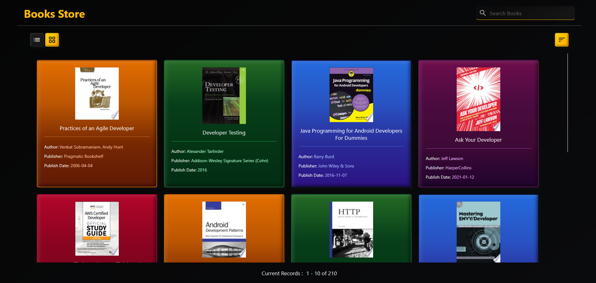
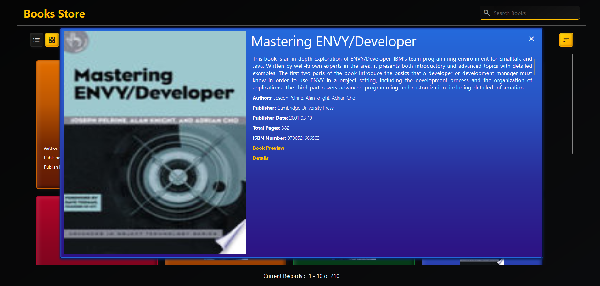

# About Books Store App
## Introduction
The Book Store Application is a user-friendly platform that allows users to browse, search, and sort books seamlessly. It features an infinite scrolling mechanism to load more books dynamically and provides multiple viewing options.
## Features
- **View Books in Store** - Users can browse through the available books in the store.
Initially, only 10 books are displayed.
- **Infinite Scrolling for Book Records** - As the user scrolls down, 10 more books are loaded dynamically.
This continues until all books are displayed.
- **List & Grid View Options** - Users can toggle between List View and Grid View to display book records.
- **View Book Details** - Clicking on any book (in list or grid view) opens its detailed information, which includes:
Title, Sub-title, Description, Author, Publisher, Published Date, ISBN Number, Book Preview Link, & Detail Link
- **Search Functionality** - Users can search for a specific book.
Search is limited to books already loaded on the UI (does not fetch new books).
- **Sort Books** - Users can sort books based on:
Title (Alphabetical order)
Published Date (Ascending order)
## User Guide
- **Navigation & Interation**
1. **Home Page** → Displays books (default: 10 books).
2. **Scroll Down** → Loads more books dynamically.
3. **View Toggle (List/Grid)** → Changes how books are displayed.
4. **Click on a Book** → Opens book details.
5. **Search Bar** → Searches within loaded books.
6. **Sort Dropdown** → Allows sorting based on title or published date.
## Technical Details:
- **Lazy Loading**: Ensures smooth user experience by loading more books as the user scrolls.
- **Sorting Logic**: Implemented in alphabetical order for title and chronological order for published date.
- **Client-Side Search**: Operates only on books currently displayed on the UI.
## Screenshots
Here's how the app looks:
- Home Page (List View):

- Home Page (Grid View):

- Details Page (List View):

- Details Page (Grid View):

- Search Option:

- Title Filter

- Date Filter

## Technologies Used:
- HTML (Structure)
- CSS (Styling)
- JavaScirpt (Functionality & API Handling)
## Future Enahancements
- Implement search across all books (not just loaded ones).
- Add filters (e.g., author, publisher).
- Allow user customization (e.g., sorting preferences, themes).